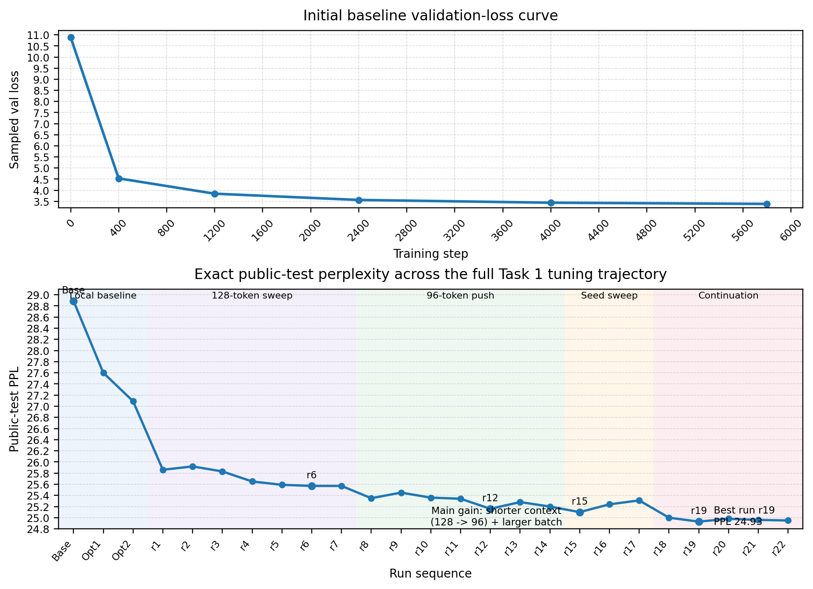

# Task 1 Report: nanoGPT on ROCStories

## Task 1 goal
Train a **scratch** nanoGPT baseline for ROCStories under the coursework constraints: no external pretrained weights, official baby-GPT scale, and model size below the **32M** cap.

## 1. Pipeline correctness
**Dataset.** `mintujupally/ROCStories` from Hugging Face. The training split contains **78,528** stories. The public test split contains **19,633** stories and was used locally as the validation / model-selection split, which is allowed by the assignment.

**Pre-processing.** Each story was tokenized with the **GPT-2 BPE tokenizer** (`tiktoken`). An explicit GPT-2 `<|endoftext|>` token was appended after every story so that the model could learn a clear story boundary. The processed corpus was written to `train.bin` and `val.bin` for the standard nanoGPT pipeline. A plain-text `test_full.txt` file was also exported for exact paragraph-level evaluation with the unmodified `eval.py` script.

**Length statistics.** The dataset is short-form: mean story length is **52.35** tokens, the 95th percentile is **69**, the maximum training length is **109**, and the maximum public-validation length is **91**. These statistics motivated a later reduction of `block_size` from 128 to 96.

## 2. Experimental rigor
**Model.** The final Task 1 model kept the official baby-GPT structure: `n_layer=6`, `n_head=6`, `n_embd=384`, `bias=False`. The model has **29.94M** parameters, so it stays within the 32M limit.

**Training.** All runs used **scratch initialization**. The final best-performing checked configuration was:

- `block_size=96`, `batch_size=80`
- `dropout=0.14`
- `learning_rate=3.5e-4`, cosine decay to `1e-5`
- `weight_decay=0.07`
- `warmup_iters=500`
- `max_iters=12000`
- `eval_interval=25`
- `seed=2027`
- `compile=False`

**Compute budget.** Local Task 1 work used a single **NVIDIA GeForce RTX 4060 Laptop GPU**. `compile=False` was kept for stable Windows execution. The strongest run family reached steady-state iteration times of roughly **42–43 ms/iter**.

## 3. Learning behaviour and tuning process
The baseline run already trained end-to-end, but later tuning substantially improved test perplexity. The tuning process is summarized in Figure 1.

### Main tuning stages
| Stage | Main change | Avg loss | PPL |
|---|---|---:|---:|
| Baseline | original scratch baseline | 3.364 | 28.89 |
| Opt1 | lower dropout, longer schedule | 3.318 | 27.60 |
| Opt2 | lower LR / WD retune | 3.299 | 27.09 |
| r6 | best 128-token family | 3.242 | 25.57 |
| r12 | short-context switch to `block_size=96` | 3.225 | 25.16 |
| r15 | best `v3` seed (`2027`) | 3.223 | 25.10 |
| r18 | longer continuation | 3.219 | 25.00 |
| **r19** | final best exact public-test run | **3.216** | **24.93** |

Two conclusions were important. First, simply training longer was less effective than improving the optimization schedule and lowering the cosine floor. Second, because ROCStories is short, reducing `block_size` from **128** to **96** improved efficiency and final public-test performance without changing model size.

## 4. Results and qualitative behaviour
**Exact public-test evaluation.** Using the unmodified evaluation workflow on the public ROCStories test split:

- paragraphs: **19,633**
- predicted tokens: **988,345**
- average loss: **3.216**
- perplexity: **24.93**

This improved substantially over the original baseline (`PPL 28.89 -> 24.93`).

**Qualitative samples.** Lower-temperature decoding (`temperature=0.7`, `top_k=40`) produced the most stable five-sentence stories. Example prompt:

> *Emily forgot her umbrella before leaving for work.*
>
> Emily forgot her umbrella before leaving for work. She took off her umbrella one day and it started to rain. She was so disappointed and started to cry. She spent all day in the rain. She was able to stay inside until she was muddy and tired.

**Brief error analysis.** The model usually captures the short ROCStories narrative rhythm, but three failure modes remain common: repetition of concepts, awkward final sentences, and larger logic jumps under higher-temperature decoding.

## 5. Task 1 requirement check
This Task 1 result satisfies the core technical requirements:

- ROCStories was converted into a nanoGPT-ready corpus.
- The model was trained **from scratch**.
- Hyperparameters and compute budget are reported clearly.
- Evaluation includes both **quantitative** results and **qualitative** samples.
- The final model remains below the **32M** size limit.

The remaining submission-side risk is not the Task 1 experiment itself, but final packaging: the best `ckpt.pt` must still be uploaded in a clean Hugging Face submission folder and verified in a **fresh, unmodified** nanoGPT repository with the original `eval.py`, `sample.py`, and `sample_batch.py` scripts.
